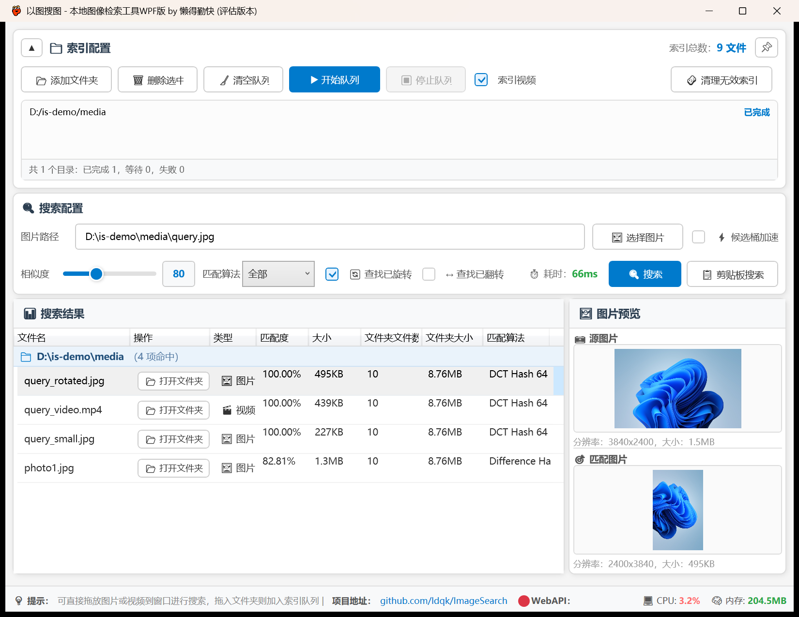
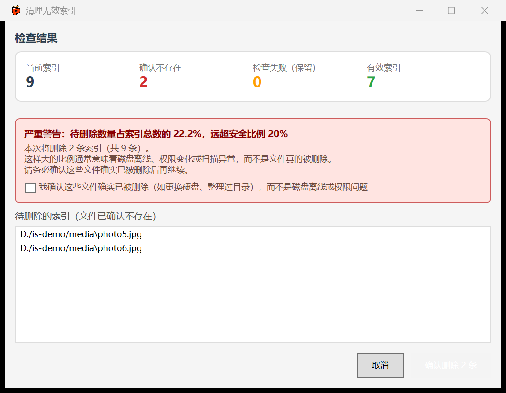

# ImageSearch

## 本仓库相对原项目的新增功能

本仓库 fork 自 [ldqk/ImageSearch](https://github.com/ldqk/ImageSearch)，在 4.0 基础上做了一批自定义增强。
下面截图使用的是一份**独立的演示素材库**（Windows 自带壁纸 + 用 ffmpeg 合成的一小段视频），不是作者的真实图库。

**视频检索** —— 视频抽取代表帧后，按与图片完全相同的方式算哈希，因此图片与视频**共用同一份索引、可以互相搜到**（结果里标 🎬 视频）。抽帧优先用 `tools/ffmpeg.exe`（可随程序分发的 LGPL v3 构建），缺失时自动退回 Windows 系统缩略图；类型判定结合文件头，因为扩展名会骗人（微信导出的 `.jpg` 常是 HEIC 或视频）。详见下方[视频检索](#视频检索)一节。

**索引队列** —— 索引目录从单个变成一条可持久化的队列：支持多个目录、各自记录完成状态、中断后下次继续、自动合并父子包含关系。执行分两阶段（先全部图片、再全部视频），因为视频抽帧约 150ms/个、图片解码约 1.7ms/个，混在一起图片会被视频堵在后面。关掉「索引视频」即进入**快速同步模式**：跳过最慢的抽帧、重扫全部目录，快速把图片的新增与变动同步进来。

**失效索引清理** —— 文件被删或移动后留下的条目永远搜不到，属于纯噪声。清理只把**明确确认不存在**的路径列为可删；权限错误、磁盘离线、查询失败一律算「检查失败」并保留。待删比例超过 5% 会警告、超过 20% 会阻止一键删除，必须手动勾选确认。

**索引库安全** —— 写入改为「先写临时文件、再原子替换」，不再在原文件上覆盖写（旧实现写到一半崩溃会留下残缺索引库）；替换前的版本留作 `.bak`，另有按日快照；主文件损坏时启动会自动从备份恢复并明确告知。

**检索** —— 并行度按物理核而非逻辑核（实测 `ProcessorCount * 4` 因过度订阅反而慢 50% 以上）；目录统计走带 TTL 的缓存；结果按文件夹分组，并自动排除查询图自身与已不存在的条目。可选「⚡ 候选桶加速」，用 DCT 分桶跳过不可能命中的条目——它是**近似**剪枝，实测相似度 ≥92% 的命中从不漏、86~91% 区间会漏 5~15%，因此默认关闭。

**WebAPI** —— 新增监听地址 `HttpHost` 与访问令牌 `ApiToken`；设为对局域网开放但未配置令牌时，会自动退回仅本机监听，避免无鉴权暴露。

**其它细节** —— 图片解码在 SkiaSharp 失败时回退 Windows WIC（应对 HEIC 伪装成 `.jpg`）；借 Everything 的 MFT 索引加速枚举，并跳过回收站；`RunAsAdmin` 默认关闭，因为提权后 Windows 的权限隔离会让「拖放图片搜索」完全失效；自动同步索引时不再弹模态框打断操作，结果走状态栏与日志。

## 环境要求
开发环境：Visual Studio 2026  
运行时：.net10 desktop  

## 硬件要求
处理器：4核或更多  
内存：8GB或更多

## 特别说明
1. 如果电脑中安装有everything，软件会自动调取everything进行目录扫描，请确保要扫描的目录已经被everything索引，如果你想让软件不自动调取everything，把目录下的everything64.dll文件删掉即可
2. 软件不支持部分区域的图片检索，只能做相似检索
3. 相似度限定70是因为低于70的相似度肉眼看上去已经是完全不一样的图了

## 视频检索
支持对本地视频建立索引并检索，原理是抽取视频的**代表帧**（类似资源管理器的视频缩略图），
再按与图片完全相同的方式计算哈希——因此视频和图片共用同一份索引，可以互相搜到。

支持格式：mp4 / mov / m4v / 3gp / avi / divx / mkv / webm / wmv / asf / mpg / mpeg / m1v / ts / mts / m2ts / m2t / vob / flv / rmvb

抽帧采用混合方案，按可用性自动选择，无需配置：
1. **ffmpeg（首选）**——独立进程，坏文件不会影响主程序，且可并行、格式覆盖最广。
   程序目录 `tools/ffmpeg.exe` 内置了一份 LGPL v3 构建（可随程序分发，仅用于解码）。
2. **Windows 系统缩略图（兜底）**——缺少 ffmpeg 时自动启用，零依赖。
   该接口非线程安全，程序内部已串行化处理。

自定义 ffmpeg：在 `config.ini` 中设置 `FFmpegPath`，或在系统 PATH 中提供 ffmpeg。
若不需要内置版本，删除 `以图搜图/tools/` 目录即可——程序仍可正常编译与运行，
只是视频抽帧退回到系统缩略图方案。

> 说明：微信等来源的短视频常短至 1~2 秒，且很多"扩展名为 .jpg、实际是 HEIC/视频"。
> 本工具以扩展名判断类型，若发现文件被错误跳过，可核对实际文件头。
## Star趋势

## 理论篇
https://segmentfault.com/a/1190000038308093

## 特别鸣谢
[Masuit.Tools](https://github.com/ldqk/Masuit.Tools)

## 本项目完全开源，以下链接的为盗版，若您在以下链接以及相关链接有任何的付费行为，请申请退款或向相关平台方投诉
https://www.chinapyg.com/forum.php?mod=viewthread&tid=162510  
https://download.csdn.net/download/china365love/92183755  
https://blog.csdn.net/china365love/article/details/153752532  
https://shop.owmei.com/
